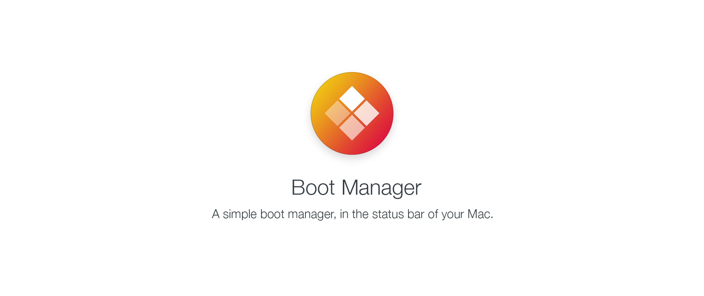

# Boot Manager

> This project has been abandoned.

**Boot Manager** – Boot Manager is a handy utility to make it easier to reboot into your Boot Camp
windows drive, or even another macOS install. It will also not permanently change your startup disk
so once you reboot again, it’ll boot back to your standard OS. Choose to boot windows or another OS,
no more waiting around holding the option key. Great for bluetooth keyboard users where option key
might not always work.

Boot Manager is especially useful for people who use non-EFI graphics cards and therefore have
lost access to the startup manager when starting up their Mac.

## Features
### Quick Reboot
Quickly reboot into Windows or alternate macOS drives, no holding of option key or startup disk changing.

### Universal Compatibility
Enable menu bar only and have quick access to rebooting to your other operating systems, like Windows.

### Boot Camp on PCI-e SSD and SATA Controllers
Support for Boot Camp in EFI mode on PCI-e SSDs and SATA PCI-e controllers.

## Installing
1. Before installing you must disable the System Integrity Protection (a.k.a. SIP).

To disable the System Integrity Protection, you must restart on the recovery partition (Recovery HD) and
access the terminal in the Utilities menu and then execute the following command:

```
csrutil disable
```

2. Then go to the Releases section of the Boot Manager repository and download the latest installation
package, and install it normally by double-clicking on it.

### Compatibility
Boot Manager supports the following operating systems in the following modes, Some of the operating systems
requires additional software.

| *Operative System*           | *Boot Modes* |
|------------------------------|--------------|
| macOS                        | EFI          |
| macOS Server                 | EFI          |
| Windows                      | BIOS, EFI    |
| Windows (Installation DVD)   | BIOS         |
| Windows (Installation USB)   | EFI          |
| Ubuntu                       | BIOS*, EFI** |
| Debian                       | BIOS*, EFI** |
| Fedora                       | BIOS*, EFI** |
| Manjaro                      | BIOS*, EFI** |
| CentOS                       | BIOS*, EFI** |
| Slackware                    | BIOS*, EFI** |
| openSUSE                     | BIOS*, EFI** |
| Linux x86 (Installation DVD) | BIOS         |
| GRUB                         | EFI**        |
| ELILO                        | EFI**        |
| Next Loader                  | EFI          |

```
* Requires FUSE for macOS to detect Linux volumes in BIOS mode.
** Requires EFI partitions to be mounted automatically at system startup in order to detect EFI Linux installations.
```

## Contributing to the Project
### Developers
Boot Manager is an open source project, where all developers are welcome to contribute to the project by
solving problems or adding new features.

If you are a developer who wants to contribute, you can make a fork of the main repository, where you
can work an add your code and then open a pull request.

### Beta Testers
You can also contribute to the project as a Beta Tester, testing each new beta version or new features
of the project and sharing your feedback with us to improve the development.

### Donating to the Project
If you don't have enough time, the equipment or enough knowledge to contribute in any of the ways
mentioned above to the project, you can also donate any amount through PayPal or Bitcoin.

##### Donate any amount:
 - [PayPal](https://www.paypal.me/abdyfranco)
 - [Bitcoin](https://www.blockchain.com/btc/payment_request?address=1LMLf1JDouaeEwpUxsH6PpFptYM4LB7b9B)

## Copyright
- Copyright (c) 2017-2018 [Abdy Franco](http://abdyfran.co/)
- Copyright (c) 2013-2014 [Buttered Cat Software](http://buttered-cat.com)
